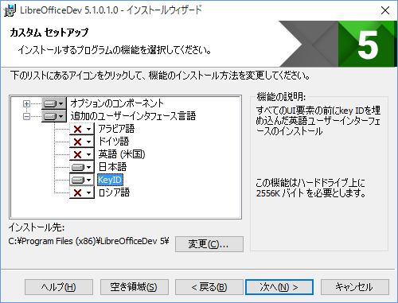

# LibreOfficeのユーザーインターフェース翻訳入門

今回はLibreOffice 5.1を例にします。プラットフォームはWindowsです。

## 概要

LibreOfficeの翻訳方法はひとつではありませんが、今回はひとまず次の手順で行います。

1. リリース版と開発版のバイナリをダウンロード&インストール
2. 開発版の表示言語をKeyIDにする
3. リリース版で翻訳するところを見つける
4. 開発版で見つけた箇所のKeyIDを確認する
5. Pootleのアカウントを取得する
6. 翻訳する
7. メーリングリストに報告する

正式版のリリース前でもLibreOfficeはRC1以降はリリース状態のコンフィグでリリースされています。よって、すでにLibreOfficeがインストールされている場合はそれを上書きします。少なくとも4系列と5系列はプロファイルが同じなので、翻訳作業確認後にアンインストールし、元のバージョンを再インストールすることはできます。

一方、開発版のみに含まれているKeyIDを使用すると、翻訳する場所が明確になります。そのKeyIDは一つの言語として扱われており、日本語と切り替える場合は再起動が必要になるため、効率よく作業するためにリリース版と開発版は同時にインストールも起動もできるという特徴を活かします。よって、リリース版と開発版をインストールし、同時に起動することにします。もちろん日本語とKeyIDを切り替えて使用してもいいのですが、非常に手間がかかり、その分効率が下がります。

実際に翻訳するWebサービスは[Pootle](http://pootle.translatehouse.org/)といい、これをdocumentfoundation.orgのドメインで運用しています。日本語ではユーザーアカウントを取得すれば誰でも翻訳の提案をすることができます。もちろんそれだけだと反映されません。反映されるためにはコミット権がある人によるチェックが必要です。LibreOfficeは翻訳する語も非常に多いため、提案するだけだとすると気づかないこともあります。確実に反映されるためには翻訳した個所をメーリングリストで報告してください。

## バイナリをダウンロード
執筆時点ではLibreOffice 5.1はプレリリースの状態のため、[Development versions](http://www.libreoffice.org/download/pre-releases/)からダウンロードしてください。リリース後は普通にダウンロードしてください。念のため[コピー](http://ikuya.info/tmp/libo/LibreOffice_5.1.0.2_Win_x86.msi)を置いておきます。

開発版はデイリービルドの[libreoffice-5-1ブランチ](http://dev-builds.libreoffice.org/daily/libreoffice-5-1/Win-x86@62-merge-TDF/current/)からダウンロードします。念のため[コピー](http://ikuya.info/tmp/libo/libreoffice-5-1-2016-01-13_00.08.26_LibreOfficeDev_5.1.0.1.0_Win_x86_en-US_de_ar_ja_ru_qtz.msi)を置いておきます。

## インストール
プレリリース版を含むリリース版は通常どおりにインストールします。前述のとおりすでにインストールされている場合は上書きされますのでご注意ください。

開発版はインストーラーの起動後[セットアップの種類]で[カスタム]を選択し(図1)、[追加のユーザーインタフェース言語]で[KeyID]もインストールするようにしてください(図2)。その後はデフォルトのままで構いません。

## 起動
プレリリース版を含むリリース版は通常どおりに起動します。

開発版は、起動後[ツール]-[オプション]-[言語]-[ユーザーインタフェース]を[KeyID]に変更し(図3)、[OK]をクリックします。その後指示どおりに再起動すると、メニューにKeyIDが表示されるようになります(図4)。

## 翻訳するところを見つける
例として、Writerのメニューを見ていると、[編集]の[Direct Cursor Mode]が翻訳されていないことに気づきました(図5)。KeyIDを確認すると、[ADz36]であることがわかりました(図6)

## Pootleのアカウントを取得する
というわけで、[Pootle](https://translations.documentfoundation.org/)にアクセスし、アカウントを取得します(図7)。[Sign in]をクリックします。

[Sign up as a new user]をクリックします(図8)。[Username]と[Email]とパスワードを2回入力し(図9)、[Sign Up]をクリックします。すると入力したメールアドレスにメールが送信されるので(図10)、送信されたメールにあるURLをクリックして登録を完了します。

ユーザー名とパスワードを入力して(図11)ログインするとライセンスの同意を求められるので(図12)、読んだ上で[これを読み受諾しました]にチェックを入れ、[次へ]をクリックすると翻訳できるようになります。

## 翻訳を提案する
まず翻訳するところを選択します(図13)。今回はLibreOffice 5.1です。よって[LibreOffice 5.1 - UI]があればそれを選択すればいいのですが、まだないので、そのような場合は[LibreOffice master - UI]が対象です。よってここをクリックします。

翻訳対象モジュールが一覧で表示されます。まずは[検索]をクリックし、検索対象を選択します。[コメント]と[位置]にチェックを入れてください(図14)。厳密にいえば[コメント]だけでいいのですが。そしてKeyIDである[ADz36]を入力して検索します。

すると該当の対象語が[表示](https://translations.documentfoundation.org/ja/libo_ui/translate/officecfg/registry/data/org/openoffice/Office/UI.po#unit=100868053)されるので、ふさわしい訳である[ダイレクトカーソルモード]と入力し、[提案]をクリックします(図15)。が、その前に[Unit #100868053](https://translations.documentfoundation.org/ja/libo_ui/translate/officecfg/registry/data/org/openoffice/Office/UI.po#unit=100868053)の文字列がリンクになっているので、そのURLをクリップボードにコピーしておきます。

## ふさわしい翻訳の考え方
今回例として[Direct Cursor Mode]を[ダイレクトカーソルモード]とカタカナにしただけですが、何故これがふさわしいかというと、LibreOfficeには以前よりダイレクトカーソル機能があるからです。[ツール]-[オプション]-[LibreOffice Writer]-[書式サポート]に[ダイレクトカーソル]というのがあります(図16)。機能としては、Writerだと文字が入力されているところにしかカーソルを移動させることができませんが、このダイレクトカーソル機能を有効にすると、入力されていないところにもカーソルを移動させることができるようになります。

このように、他で使われているところがある場合はそれに合わせたほうがいいですし、Microsoft Word / Excel / PowerPointにも似たような機能がある場合はそれを参考にしてもいいですし、専門用語はそのとおり訳したほうがいいでしょう。もちろん直感的に見てわかるのであればそれに越したことはありませんが、専門用語だとWeb検索や書籍の索引で探しやすというメリットもありますし、そもそもからしてLibreOfficeは非常にたくさんの機能があり、一概にこうするべきだということはできません。よって総合的に判断するしかありません。

Pootleは日本語の検索には弱いですが、英語だと特に問題がないため、事前に似たような翻訳がないかを検索するのも非常に有意義です。翻訳が揺れている（特段の理由がないにもかかわらず、同じ原文で違う言語が割り当てられている）場合ももちろん改善の対象です。

## メーリングリストに報告する
これは必須ではありません。

翻訳の提案をし、それを適用して欲しい場合は、[メーリングリスト](http://ja.libreoffice.org/get-help/mailing-lists/)に報告してください。具体的にはdiscuss@ja.libreoffice.orgです。また、メーリングリストに加入しなくても投稿することもできます([参考](http://naruoga.hatenablog.com/entry/2015/12/09/014615))。

報告する場合は対象語のURL(Unit #)を添えてください。そうすると検索する必要がなくなり、対応が早くなります。また、結果的に提案した翻訳がそのまま適用されないこともありますが、あなたという存在が否定されたわけではないので気にしないでください。

どのように翻訳したらいいのか、もっと言えばどのような考えに立って翻訳したらいいのかの意見を広く募る場合にも、メーリングリストは有効です。

## こんなときはどうする？
- Pootleにアクセスできない…しょっちゅう止まります。どうしようもないので諦めて他のことをしましょう。
- メーリングリストじゃなくて関係者に直接連絡したりするのはダメですか？…絶対にダメです。特定の関係者にDoS攻撃をしかけるようなことは絶対にやめましょう。また、意思決定がクローズドかつ/または遡及不可能というのもまたよくありません。
- 翻訳が適用されたか確認したいのですが…次のリリースビルドを待つか、自分でソースコードを取得し、翻訳部分をアップデートしてビルドするしかありません。翻訳はリアルタイムにソースコードに反映されるわけではなく、リリース直前(正確にいえばタグが打たれる直前)にソースコードに反映されます。
- 既存の翻訳を見直したい…メーリングリストでの議論が必須ですが、既存の翻訳の見直しも積極的に行っているので、ご提案ください。ソースコードも時代と共に変わるのと同じように、翻訳も時代と共に変わるべきだと考えています。
- 参考にすべきwikiはありますか？…[あります](https://wiki.documentfoundation.org/JA/Translation)
- 定訳リストはありますか？…[あります](https://wiki.documentfoundation.org/JA/Translation/Terminology)

